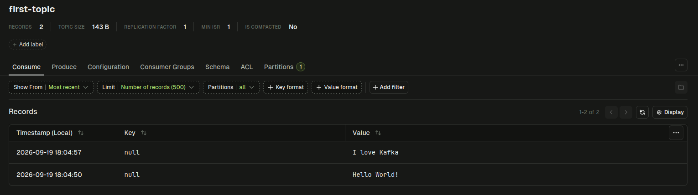
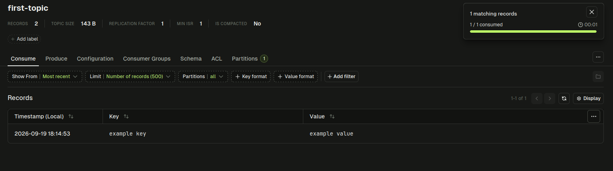
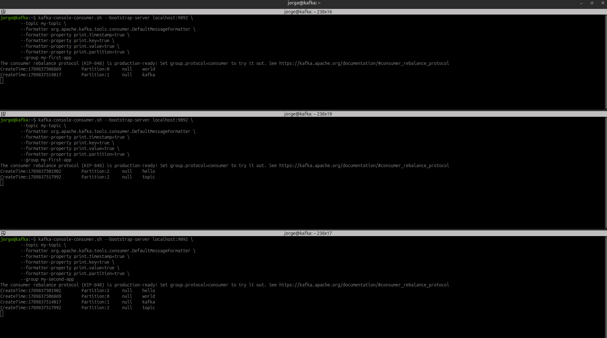

# Kafka CLI

## kafka-topics.sh

**Create topic**
```bash
kafka-topics.sh --bootstrap-server localhost:9092 --topic first-topic --create
```
Expected output:
```bash
Created topic first-topic.
```

**List topics**
```bash
kafka-topics.sh --bootstrap-server localhost:9092 --list 
```
Expected output:
```bash
first-topic
```

**Describe a topic**
```bash
kafka-topics.sh --bootstrap-server localhost:9092 --topic first-topic --describe
```
Expected output:
```bash
Topic: first-topic      TopicId: qH3oOt2ZS_mAPkc9w8I1Gg PartitionCount: 1       ReplicationFactor: 1    Configs: 
        Topic: first-topic      Partition: 0    Leader: 1       Replicas: 1     Isr: 1  Elr:    LastKnownElr: 
```


**Delete topic (only works if delete.topic.enable=true)**
```bash
kafka-topics.sh --bootstrap-server localhost:9092 --topic first-topic --delete
```

**Create topic with partitions and describe**
```bash
kafka-topics.sh --bootstrap-server localhost:9092 --topic first-topic --create --partitions 3 
```
After describe:
```bash
Topic: first-topic      TopicId: FJLCoUL-Q7akwo2TD9ETig PartitionCount: 3       ReplicationFactor: 1    Configs: 
        Topic: first-topic      Partition: 0    Leader: 1       Replicas: 1     Isr: 1  Elr:    LastKnownElr: 
        Topic: first-topic      Partition: 1    Leader: 1       Replicas: 1     Isr: 1  Elr:    LastKnownElr: 
        Topic: first-topic      Partition: 2    Leader: 1       Replicas: 1     Isr: 1  Elr:    LastKnownElr: 
```

**Create topic with partitions and replication factor**
```bash
kafka-topics.sh --bootstrap-server localhost:19092 --topic first-topic --create --partitions 3 --replication-factor 2
```

## kafka-console-producer.sh

### Produce without keys
**Create a topic with 1 partition**
```bash
kafka-topics.sh --bootstrap-server localhost:9092 --topic first-topic --create --partitions 1
```

**Produce**
```bash
kafka-console-producer.sh --bootstrap-server localhost:9092 --topic first-topic 
```



**Produce with properties**
```bash
kafka-console-producer.sh --bootstrap-server localhost:9092 --topic first-topic --command-property acks=all
```

**Produce in round-robin partitions**
```bash
kafka-console-producer.sh --bootstrap-server localhost:9092 --topic first-topic \
        -command-property  partitioner.class=org.apache.kafka.clients.producer.RoundRobinPartitioner
```

**Produce to a non existing topic** --> different behaviour on auto topic creates, normally disable
```bash
kafka-console-producer.sh --bootstrap-server localhost:9092 --topic new-topic 
```
### Produce with keys

```bash
kafka-console-producer.sh --bootstrap-server localhost:9092 --topic first-topic \
        --reader-property  parse.key=true \
        --reader-property  key.separator=:
```



## kafka-console-consumer.sh

**Consume from the tail of the topic (default)**
```bash
kafka-console-consumer.sh --bootstrap-server localhost:9092 --topic first-topic 
```

**Consume from the beginning of the topic**
```bash
kafka-console-consumer.sh --bootstrap-server localhost:9092 --topic first-topic --from-beginning
```

**Consume displaying key, value and timestamp**
```bash
kafka-console-consumer.sh --bootstrap-server localhost:9092 \
        --topic first-topic \
        --formatter org.apache.kafka.tools.consumer.DefaultMessageFormatter \
        --formatter-property print.timestamp=true \
        --formatter-property print.key=true \
        --formatter-property print.value=true \
        --formatter-property print.partition=true 
```
Producing with round robin partitions and `null` keys:
```bash
The consumer rebalance protocol (KIP-848) is production-ready! Set group.protocol=consumer to try it out. See https://kafka.apache.org/documentation/#consumer_rebalance_protocol
CreateTime:1789835236339        Partition:1     null    first value
CreateTime:1789835246032        Partition:0     null    second value
CreateTime:1789835260448        Partition:2     null    third value
CreateTime:1789835274452        Partition:1     null    forth value
```
Producing with round robin partitions and keys:
```bash
The consumer rebalance protocol (KIP-848) is production-ready! Set group.protocol=consumer to try it out. See https://kafka.apache.org/documentation/#consumer_rebalance_protocol
CreateTime:1789835527146        Partition:1     first key       first value
CreateTime:1789835547458        Partition:0     second key      second value
CreateTime:1789835560076        Partition:2     first key       second value
CreateTime:1789835581807        Partition:1     third key       third value
CreateTime:1789835590064        Partition:0     forth key       forth value
```
## kafka-console-consumer.sh with --group parameter
```text
                ┌───────────────────────────┐
                │        TOPIC              │
                │        my-topic           │
                └───────────────────────────┘

        ┌────────────┬────────────┬────────────┬────────────┬────────────┐
        │ Partition 0│ Partition 1│ Partition 2│ Partition 3│ Partition 4│
        └──────┬─────┴──────┬─────┴──────┬─────┴──────┬─────┴──────┬─────┘
               │             │             │             │             │
               │             │             │             │             │
        ┌──────▼──────┐ ┌────▼──────┐ ┌────▼──────┐ ┌────▼──────┐ ┌────▼──────┐
        │ consumer-1  │ │ consumer-1│ │ consumer-2│ │ consumer-2│ │ consumer-3│
        └─────────────┘ └───────────┘ └───────────┘ └───────────┘ └───────────┘


        ┌──────────────────────────────────────────────┐
        │ consumer-group-application                   │
        │                                              │
        │  consumer-1 → partitions 0,1                 │
        │  consumer-2 → partitions 2,3                 │
        │  consumer-3 → partition 4                    │
        └──────────────────────────────────────────────┘

```
**Create a topic with 3 partitions**
```bash
kafka-topics.sh --bootstrap-server localhost:9092 --topic my-topic --create --partitions 3
```
**Start 3 consumers, two in the same group**
```bash
kafka-console-consumer.sh --bootstrap-server localhost:9092 \
        --topic my-topic \
        --formatter org.apache.kafka.tools.consumer.DefaultMessageFormatter \
        --formatter-property print.timestamp=true \
        --formatter-property print.key=true \
        --formatter-property print.value=true \
        --formatter-property print.partition=true \
        --group my-first-app
```
```bash
kafka-console-consumer.sh --bootstrap-server localhost:9092 \
        --topic my-topic \
        --formatter org.apache.kafka.tools.consumer.DefaultMessageFormatter \
        --formatter-property print.timestamp=true \
        --formatter-property print.key=true \
        --formatter-property print.value=true \
        --formatter-property print.partition=true \
        --group my-second-app
```
**Produce with round robin partitions**
```bash
kafka-console-producer.sh --bootstrap-server localhost:9092 --topic my-topic \
        --command-property partitioner.class=org.apache.kafka.clients.producer.RoundRobinPartitioner 
```




## kafka-consumer-groups.sh

**Create consumer groups**

Are automatically create when we execute the `--group` parameter with `kafka-console-consumer.sh`

**List consumer groups**
```bash
kafka-consumer-groups.sh --bootstrap-server localhost:9092 --list
```

**Describe consumer groups**
```bash
kafka-topics.sh --bootstrap-server localhost:9092 --group my-group --describe
```

**Delete consumer groups**
```bash
kafka-topics.sh --bootstrap-server localhost:9092 --topic first-topic --delete
```

## kafka-consumer-group.sh with -reset-offsets parameter
Kafka stores messages on brokers for the period defined by the retention policy, even after consumers have read them.

**Reset offsets**
```bash
# Dry run
kafka-consumer-groups.sh --bootstrap-server localhost:9092 --group my-first-app --reset-offsets --to-earliest --topic my-topic --dry-run
kafka-consumer-groups.sh --bootstrap-server localhost:9092 --group my-first-app --reset-offsets --to-earliest --topic my-topic --execute
```

## kafka-config.sh
The `kafka-configs.sh` command is used to view and modify Kafka configuration settings.

**Describe All Topic Configurations**
```bash
kafka-configs.sh \
  --bootstrap-server localhost:9092 \
  --entity-type topics \
  --entity-name my-topic \
  --describe \
  --all
```

**Describe Dynamic Topic Configurations**
```bash
kafka-configs.sh \
  --bootstrap-server localhost:9092 \
  --entity-type topics \
  --entity-name my-topic \
  --describe \
```