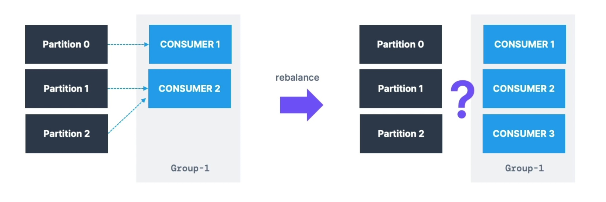
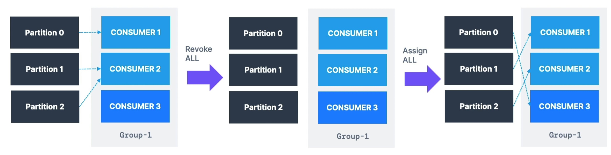
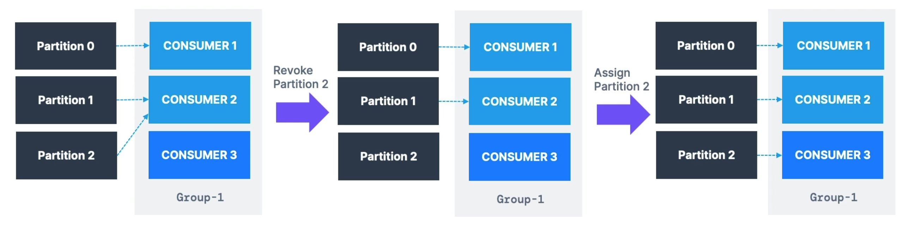
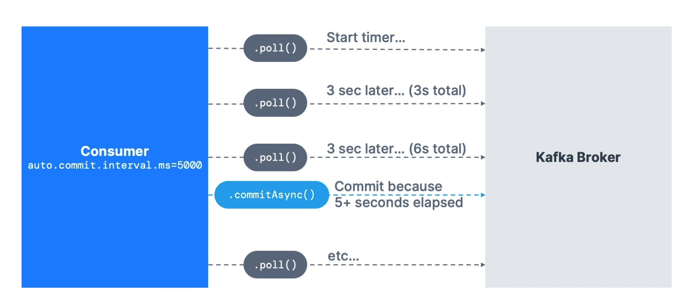

# Kafka Client Application
## SDK list of Kafka
[SDK List](https://www.conduktor.io/kafka/kafka-sdk-list)

## Rust Client Application using rdkafka
**rdkafka** is a Rust wrapper for **librdkafka**, a client library written in **C/C++**

[rdkafka Github](https://github.com/fede1024/rust-rdkafka)

[rdkafka crate](https://crates.io/crates/rdkafka)

[librdkafka Github](https://github.com/confluentinc/librdkafka)
## Build a Producer
### Callbacks
When sending a record
```java
producer.send(record);
```
Kafka sends the record asynchronously. The program continues running without waiting for Kafka to confirm the message.

A **callback** is a function that Kafka executes when the send operation finishes:
```java
// send data - asynchronous
            producer.send(producerRecord, new Callback() {
                public void onCompletion(RecordMetadata recordMetadata, Exception e) {
                    // executes every time a record is successfully sent or an exception is thrown
                    if (e == null) {
                        // the record was successfully sent
                        log.info("Received new metadata. \n" +
                                "Topic:" + recordMetadata.topic() + "\n" +
                                "Partition: " + recordMetadata.partition() + "\n" +
                                "Offset: " + recordMetadata.offset() + "\n" +
                                "Timestamp: " + recordMetadata.timestamp());
                    } else {
                        log.error("Error while producing", e);
                    }
                }
            });
```
The callback receives:
- **metadata**: information about the sent record, such as the topic, partition, offset, and timestamp.
- **exception**: the error that occurred, if the message could not be sent.

A callback is useful for checking whether the message was successfully delivered. The exception can be caused by different parts of the sending process: broker, network, producer, etc.

### Sticky Partitioner
A Kafka topic can have several partitions:
```text
demo_topic
├── Partition 0
├── Partition 1
└── Partition 2
```
When a record has no key:
```java
new ProducerRecord<>("demo_topic", "hello world");
```
Kafka must decide which partition to use.

The sticky partitioner selects one partition and tries to send several consecutive records to that same partition. This allows Kafka to fill a batch before sending it:
```text
Records 1, 2, 3, 4 → Partition 1
Records 5, 6       → Partition 0
Records 7, 8, 9    → Partition 2
```
This improves performance because Kafka sends records in batches instead of sending many small requests.

The sticky partitioner does not mean that all records will always go to the same partition. Kafka can switch partitions when a batch is full or when the configured waiting time expires.


If a record has a key:
```java
new ProducerRecord<>("demo_topic", "user-123", "Hello Kafka");
```
Kafka uses the key to determine the partition:
```text
user-123 → Partition 1
user-123 → Partition 1
user-123 → Partition 1
```
This is useful when messages related to the same entity must remain in order.
## Build a Consumer
### Graceful Shutdown
### Consumer Groups and Partition Rebalance
Movin partitions between consumers is called a **rebalance**. Reassignment of partitions happen when a consumer leaves or joins a group. It also happens if an administrator add new partitions into a topic. 



There are several strategies on how to rebalance partitions:
- Eager Reblance
    - All consumer stop, give up their membership of partitions
    - They rejoin the consumer group and get a new partition assignment
    - During a short period of time, the entire consumer group stops processing
    - Consumers don't necessarily "get back" the same partition as they used to



- Cooperative Rebalance (Incremental Rebalance)
    - Reassigning a small subset of the partitions from one consumer to another
    - Other consumers that do not have reassigned partitions can still process uninterrumped
    - Can go through several iterations to find a "stable" assignment (hence "incremental")
    - Avoid "stop the world" events where all consumers stop processing data



### Consumer Groups and Static Goup Membership
By default, when a consume leaves a group, its partitions are revoked and re-assigned. If it join back, it will have a new "member ID" and new partitions assigned. If you specify `gropu.instance.id` it makes the consumer a **static member**. Upon leaving, the consumer group has up to `session.timeout.ms` to joiun back and get back its partitions (else they will be reassigned), without trigerring a rebalance. This is helpful when a consumers maintain local state and cache (to avoid rebuilding the cache)

### Auto Offset Commit Behavior
Offsets are regulary committed.



