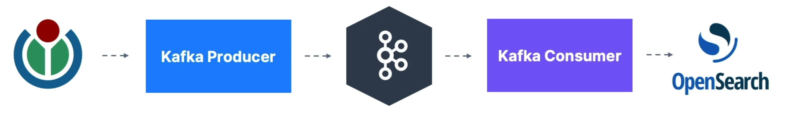
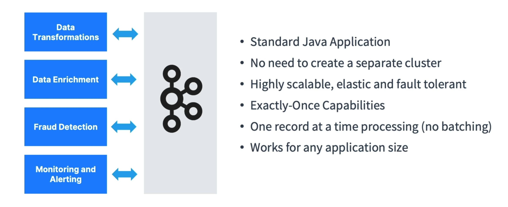
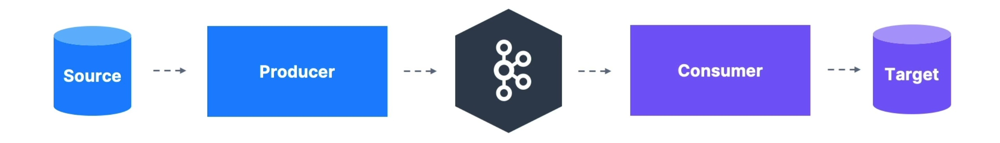
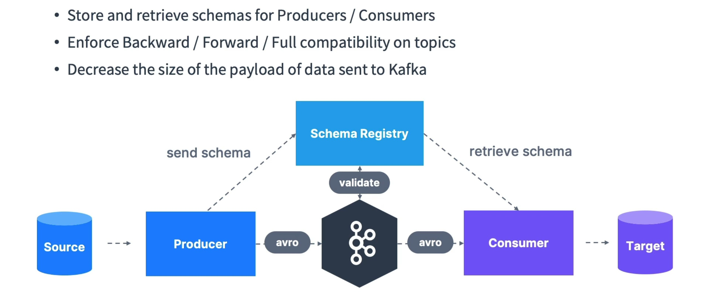
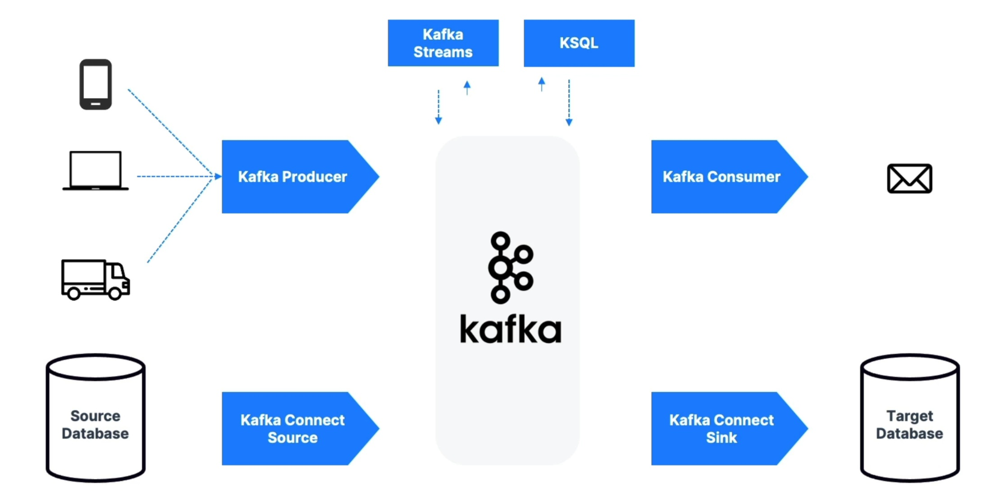

# Real World 

## Real World Application: Wikimedia Stream to OpenSearch

## Kafka Ecosystem: Extended API for Developers
Kafka Consumer and Producers have existed for a long time, and they are considered **low level**

A number of additional tools and libraries have been developed for Kafka over the years to expand its functionality. The sections below cover some of the most popular parts of the wider Kafka ecosystem. Kafka and ecosystem has introduced over time some new API that are **high level** that solves specific sets of problems:

- **Kafka Connect** solves external source -> Kafka and Kafka -> External Sink
- **Kafka Streams** solves transformations Kafka -> Kafka
- **Schema Registry** helps using Schema in Kafka

### Kafka Connect
[Introduction to Kafka Connect](https://developer.confluent.io/courses/kafka-connect/intro/)

[Available Kafka Connectors](https://www.confluent.io/hub/plugins)

[Kafka Connect Source connector from wikimedia](https://github.com/conduktor/kafka-connect-wikimedia)

[List of Kafka Connect connectors.](https://github.com/conduktor/awesome-kafka-connect)

In order to get data into Apache Kafka, we have seen that we need to use Kafka producers. Over time, it has been noticed that many companies shared the same data source types (databases, systems, etc...) and so writing open-source standardized code could be helpful for the greater good. The same thinking goes for Kafka Consumers.

Kafka Connect is a tool that allows us to integrate popular systems with Kafka. It allows us to re-use existing components to source data into Kafka and sink data out from Kafka into other data stores.

At a high level:
- **Source Connectors** to get data from Common Data Sources
- **Sink Connectors** to publish that data in Common Data Stores
- Make it easy for non-experienced dev to quickly get their data reliably into kafka
- Part of your ETL (Extract Trandsform and Load) pipeline
- Scaling made easy from small pipelines to company-wide pipelines
- Other programmers may already have done a very good job with reusable code
- Connectors achieve fault tolerance, idempotence, distribution, ordering, etc

Examples of popular Kafka Connectors include:

- **Kafka Connect Source Connectors (producers)**: Databases (through the Debezium connector), JDBC, Couchbase, GoldenGate, SAP HANA, Blockchain, Cassandra, DynamoDB, FTP, IOT, MongoDB, MQTT, RethinkDB, Salesforce, Solr, SQS, Twitter, etc…
- **Kafka Connect Sink Connectors (consumers)**: S3, ElasticSearch, HDFS, JDBC, SAP HANA, DocumentDB, Cassandra, DynamoDB, HBase, MongoDB, Redis, Solr, Splunk, Twitter

### Kafka Streams
[Introduction to Kafka Streams](https://developer.confluent.io/courses/kafka-streams/get-started/)

Once we have produced data from external systems into Kafka, we may want to process them using stream processing applications. Stream processing applications make use of streaming data stores like Apache Kafka to provide real-time analytics.

Kafka Streams is an easy **data processing and tranformation library** within Kafka 

For example, let's assume we are having a Kafka topic named `twitter_tweets` that is a data streaming of all tweets on Twitter. From this topic, we may want to:

- Filter only tweets that have over 10 likes or replies, to capture important tweets
- Count the number of tweets received for each hashtag every 1 minute
- Combine the two to get trending topics and hashtags in real-time!

In order to perform topic-level transformation within Apache Kafka, we can use streaming libraries that are meant for this use case instead of writing very complicated producer & consumer code.

In that case, we can use the Kafka Streams library, which is a stream processing framework that is released alongside Apache Kafka. Alternatives you may have heard of for Kafka Streams are Apache Spark, or Apache Flink.

### Kafka Schema Registry
[Introduction to Kafka Schema Registry](https://developer.confluent.io/courses/schema-registry/key-concepts/)

Data schemas define for your data the expected fields, their names, and value types

Without a schema registry, producers and consumers are at the risk of breaking when the data schema changes.

Caracteristics:
- The Schema Registry is a separate component from the Kafka Brokers. 
- Producers and consumer need to be able to talk to Schema Registry. 
- Schema Registry must be able to reject bad data
- A common data format must be agreed upon
    - It needs to support schema
    - It needs to support evolution
    - It needs to be lightweight
- **Apache Avro** as the data format (Protobuf, JSON Schema also supported)

A pipeline without Schema Registry looks like this

A pipeline with Schema Registry looks like this

### KsqlDB
ksqlDB is a stream processing database that provides a SQL-like interface to transform Kafka topics and perform common database-like operations such as joins, aggregates, filtering, and other forms of data manipulation on streaming data.

Behind the scenes, the ksqlDB webserver translates the SQL commands into a series of Kafka Streams applications.

### Which API is right for me?
- About Producing Data:
    - If you have a source DB or your data already somewhre you want to put into Kafka -> **Kafka Connect Source**
    - If you want to produce the data directly into Kafka -> **Kafka Producer**
- About Data Transformations:
    - **Kafka Streams**
    - **KSQL** -> Allow you to do SQL queries on top of Kafka by also leveraging internally Kafka Streams
- About Consuming Data:
    - If you want to send data into a target for storage and for analysis later on -> **Kafka Connect Sink**
    - If you just want to send data into a target (example: email) -> **Kafka Connect Sink**
- About Data Verification -> **Schema Registry**

## Real World Architectures and Case Studies
### Partitions Count and Replication Factor
- The most important parameters when creating a topic
- They impact performance and durability of the system overall
- It is best to get the parameters right the first time!
    - If the partitions count increases during topic lifecycle, you will break your keys ordering guarantees
    - If the replication factor increases during a topic lifecylce, you put more pressure on your cluster, which can lead to unexpected performance decrease

### Case Study
- MovieFlix
- GetTaxi
- MySocialMedia
- MyBank
- Big Data Ingestion
- Logging and Metrics Aggregation
