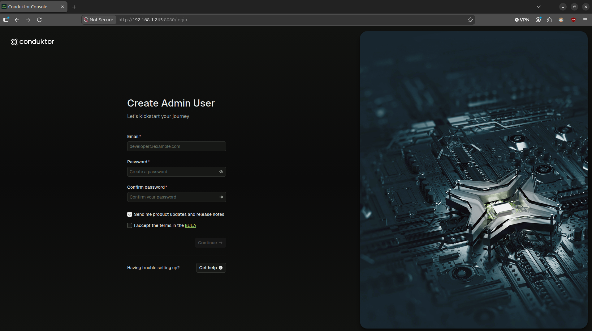

# Starting Kafka

## Linux
[How to install Apache Kafka on Linux](https://www.conduktor.io/kafka/how-to-install-apache-kafka-on-linux)

**Step 1: Install Amazon Corretto 21**
```bash
wget -O - https://apt.corretto.aws/corretto.key | sudo gpg --dearmor -o /usr/share/keyrings/corretto-keyring.gpg && \
echo "deb [signed-by=/usr/share/keyrings/corretto-keyring.gpg] https://apt.corretto.aws stable main" | sudo tee /etc/apt/sources.list.d/corretto.list
sudo apt-get update; sudo apt-get install -y java-21-amazon-corretto-jdk
```
**Step 2: Verify the installation of Java**
```bash
java -version
```
Expected output:
```bash
openjdk version "21.0.12.1" 2026-08-18 LTS
OpenJDK Runtime Environment Corretto-21.0.12.9.1 (build 21.0.12.1+9-LTS)
OpenJDK 64-Bit Server VM Corretto-21.0.12.9.1 (build 21.0.12.1+9-LTS, mixed mode, sharing)
```
**Step 3: Install Kafka**
```bash
wget -O kafka_2.13-4.3.1.tgz "https://www.apache.org/dyn/closer.lua/kafka/4.3.1/kafka_2.13-4.3.1.tgz?action=download"
tar -xzf kafka_2.13-4.3.1.tgz
```
**Step 4: Add Kafka Binaries to PATH**
`~/.bashrc`
```bash
export KAFKA_HOME=$HOME/kafka_2.13-4.3.1
export PATH="$KAFKA_HOME/bin:$PATH"
```
Load new `PATH`
```bash
source ~/.bashrc
```
**Step 5: Verify the installation of Java**
```bash
kafka-topics.sh --version
```
Expected output:
```bash
4.3.1
```
## Linux with brew
- 1) Install brew
- 2) Install kafka using brew (will install Java JDK for you)
- 3) Sart KAfka using the binaries
## Docker
[How to start Kafka using Docker](https://www.conduktor.io/kafka/how-to-start-kafka-using-docker)

**Step 1: Clone the repository**
```bash
git clone https://github.com/conduktor/kafka-stack-docker-compose.git
cd kafka-stack-docker-compose
```

**Step 2: Start the cluster (one broker)**
```bash
docker compose -f conduktor-kafka-single.yml up -d
```

**Step 3: Verify the cluster**
```bash
docker compose -f conduktor-kafka-single.yml ps
```
Expected output:
```bash
NAME                                             IMAGE                                COMMAND                  SERVICE             CREATED              STATUS                                 PORTS
kafka-stack-docker-compose-conduktor-console-1   conduktor/conduktor-console:1.46.2   "/__cacert_entrypoin…"   conduktor-console   About a minute ago   Up About a minute (health: starting)   0.0.0.0:8080->8080/tcp, [::]:8080->8080/tcp
kafka-stack-docker-compose-postgresql-1          postgres:14                          "docker-entrypoint.s…"   postgresql          About a minute ago   Up About a minute                      5432/tcp
kafka1                                           confluentinc/cp-kafka:8.0.0          "/etc/confluent/dock…"   kafka1              About a minute ago   Up About a minute                      0.0.0.0:9092->9092/tcp, [::]:9092->9092/tcp, 0.0.0.0:9099->9099/tcp, [::]:9099->9099/tcp, 0.0.0.0:9999->9999/tcp, [::]:9999->9999/tcp, 0.0.0.0:29092->29092/tcp, [::]:29092->29092/tcp
```
Kafka is available at `localhost:9092`

Conduktor UI is available at `localhost:8080`



**Step 4: Run Kafka commands inside the container**
```bash
docker exec -it kafka1 /bin/bash
```
Inside the container, run commands without the `.sh` extension:
```bash
kafka-topics --version
```
Expected output:
```bash
[appuser@kafka1 ~]$ kafka-topics --version
8.0.0-ccs
```

**Step 5: Run Kafka commands outside the container**
Install the Kafka binaries on your system (skip the steps for starting ZooKeeper and Kafka):
```bash
kafka-topics.sh --version
```
Expected output:
```bash
jorge@kafka:~$ kafka-topics.sh --version
4.3.1
```
**Step 6: Stop and clean up**

Stop containers (preserves data):
```bash
docker compose -f conduktor-kafka-single.yml stop 
```
Remove containers and network (removes data):
```bash
docker compose -f conduktor-kafka-single.yml down
```
